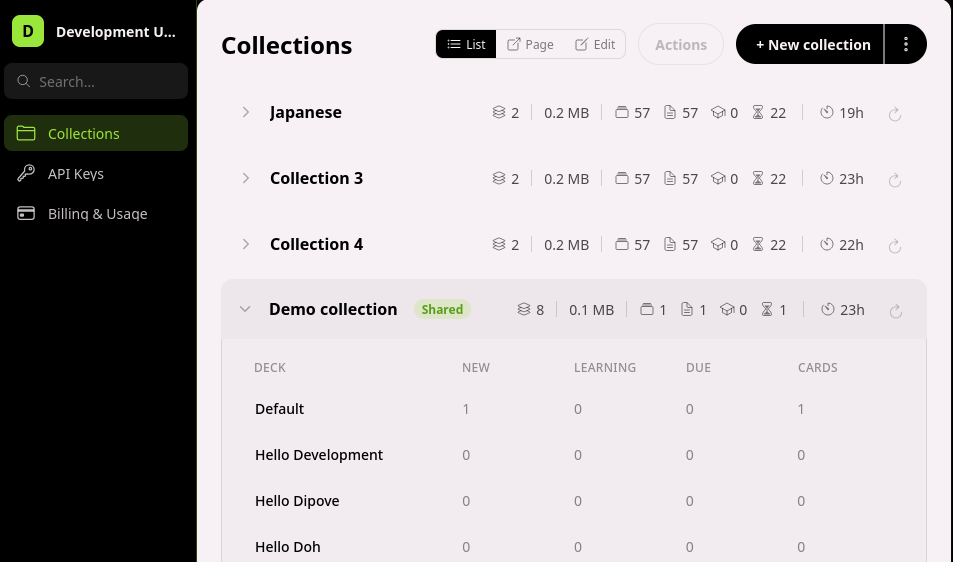

# Ænkidu

<sub>**Ankidu.de** - web: [ankidu.de](https://ankidu.de)</sub>



## About

Ænkidu turns Anki into a **cloud service** - your decks, cards, and review scheduling run entirely on our server, so there's **no desktop Anki process to install, launch, or keep running**.

It also supports ankiconnect too! Point your existing AnkiConnect tools, browser extensions, importers, and even AI assistants at Ænkidu over the network and they just work - your collection lives in the cloud. Spin on!

## Ænkidu - Hosted Anki Service

Ænkidu is a **process-less, multi-tenant Anki server**. It faithfully implements the familiar **AnkiConnect** JSON-RPC API (cards, decks, models, notes, search, and stats) plus a pure Anki REST HTTP API, so the tools you already use keep working - no local Anki app, no plugins required.

<!-- <a href="https://ko-fi.com/">
  
</a> -->

> **The Ænkidu SaaS will be live in early Oct 2026.** Hosted multi-tenant Anki with AnkiConnect compatibility, media and imports, and AI assistants via MCP. Available at [ankidu.de](https://ankidu.de).

## Why is a hosted service necessary?

Anki traditionally requires a desktop process running locally for AnkiConnect clients to talk to. That's limiting - the machine has to be on, awake, and running Anki. Ænkidu ships an **always-on cloud engine** that hosts each user's collection server-side. You can use your existing AnkiConnect-compatible apps against it from anywhere, without your PC running.

## Key Features of Ænkidu

- **Process-less Anki** - no desktop Anki install and no local Anki process required

- **Drop-in AnkiConnect compatibility** - existing clients (e.g. Yomitan and other AnkiConnect tools) work unchanged

- **Faithful AnkiConnect API** - cards, decks, models, notes, search, and stats, similar behavior and quirks

- **Modern REST HTTP API too** - clean `v1/anki` endpoint for building your own integrations - /collection/1/decks, /collection/1/cards, etc

- **Multi-tenant & isolated** - every account's collections are scoped and isolated per user

- **Multiple collections per account** - each collection behaves like its own Anki profile

- **Import / export your `.colpkg`** - bring your existing collection in, take it out any time

- **Modern scheduling** - powered by Anki's current spaced-repetition scheduler

- **AI-ready via MCP** - a built-in Model Context Protocol server auto-generates one tool per REST endpoint straight from the OpenAPI spec (through the same auth/validation pipeline), so LLM clients like ChatGPT get the full collection surface through natural language

- **Secure by design** - OAuth 2.1 authorization and API keys

- **Always on** - your collection is available around the clock, from any device, anywhere

- **Future proof** - a maintained, cloud-native service that evolves with the Anki ecosystem

- **Fully tested** - Anki tests are run against the server to achieve the same reliability as the Desktop app

- **Media & attachments** - images and audio stored server-side (``/`[sound:]` in notes, `storeMediaFile`/`retrieveMediaFile`), storage capped per user

- **Demo it instantly** - demo keys hit a shared sandbox collection (rate-limited, capped note count) - no signup needed to test AnkiConnect compatibility

## Why Ænkidu?

There are ways to expose Anki over the network already. **What sets Ænkidu apart?**

Ænkidu doesn't just tunnel to a copy of desktop Anki - it **replaces the local Anki process entirely** with a purpose-built, multi-tenant cloud service. No fragile local setup, no "is my PC awake?" - real availability from any device at any time.

It's **faithful to AnkiConnect on purpose**: the goal is that the tools people already love keep working, while giving developers a modern REST API and AI assistants a first-class MCP interface to the same collection.

Ænkidu was named after the sumerian legend, Enkidu. But his domain name was taken. It intends to invoke the image of the [battle between Gilgamesh and Enkidu from Fate](https://www.youtube.com/watch?v=Ti1TjrSg9-g)

---

## API Reference

<sub>Base URL: `https://api.ankidu.de` - Auth: `Bearer <JWT>` for REST, `keyId.secret` in the `key` field for AnkiConnect</sub>

<details>
<summary><code>GET</code> <b>/v1/anki/collections</b> - List your collections</summary>

<br>

**Auth:** `Bearer <JWT>`

**Response `200`**

```json
{
  "collections": ["1", "2", "3"]
}
```

</details>

<details>
<summary><code>GET</code> <b>/v1/anki/collections/{collectionId}/search/cards</b> - Find cards by Anki query</summary>

<br>

**Auth:** `Bearer <JWT>`

**Parameters**

| In    | Name           | Type   | Example                |
| ----- | -------------- | ------ | ---------------------- |
| path  | `collectionId` | string | `1`                    |
| query | `query`        | string | `deck:Japanese is:due` |

**Request**

```http
GET /v1/anki/collections/1/search/cards?query=deck:Japanese%20is:due
Authorization: Bearer <JWT>
```

**Response `200`**

```json
{
  "ids": ["1712345678901", "1712345678902"],
  "count": 2
}
```

</details>

<details>
<summary><code>POST</code> <b>/v1/anki/collections/{collectionId}/notes</b> - Add a note to a deck</summary>

<br>

**Auth:** `Bearer <JWT>`

**Request**

```http
POST /v1/anki/collections/1/notes
Authorization: Bearer <JWT>
Content-Type: application/json
```

```json
{
  "note": {
    "notetypeId": "1607392319495",
    "fields": ["犬", "dog"],
    "tags": ["animals", "n5"]
  },
  "deckId": "1607392319000"
}
```

**Response `200`**

```json
{
  "noteId": "1712345679001",
  "count": 1
}
```

</details>

<details>
<summary><code>POST</code> <b>/</b> - AnkiConnect-compatible JSON-RPC (point Yomitan &amp; friends here)</summary>

<br>

**Auth:** carried in the `key` field (`keyId.secret`) - no header needed

**Request - `deckNames`**

```json
{
  "action": "deckNames",
  "version": 6,
  "key": "5e7d1f8t2e04.8a1f...b22f"
}
```

**Response `200`**

```json
{
  "result": ["Default", "Japanese"],
  "error": null
}
```

**Request - `addNote`**

```json
{
  "action": "addNote",
  "version": 6,
  "key": "3f9a1c7b2e04.9d1e...c62a",
  "params": {
    "note": {
      "deckName": "Japanese",
      "modelName": "Basic",
      "fields": { "Front": "犬", "Back": "dog" },
      "tags": ["animals"]
    }
  }
}
```

**Response `200`**

```json
{
  "result": 1712345679001,
  "error": null
}
```

</details>

## Secure AnkiConnect API Key access

Ænkidu keys use an AnkiConnect-friendly `keyId.secret` bearer format, so you paste one string into any AnkiConnect client (Yomitan, etc.) and you're done. You can create and manage keys two ways:

### Option 1 - The `ankidu` CLI

The CLI logs you in securely (your password is exchanged for a short-lived token - the key itself is shown **only once**, and only its hash is ever stored server-side):

```bash
# Log in securely (opens the ankidu.de sign-in, no password stored locally)
ankidu login

# Mint an AnkiConnect key bound to a collection
ankidu keys create --name "yomitan-laptop"
# → ankidu key issued (copy it now, it won't be shown again):
#   4f9e1c3eee04.9f4e...c75a

# Manage existing keys
ankidu keys list
ankidu keys revoke 4f9e1c3eee04
```

Then point any AnkiConnect client at your Ænkidu endpoint and set the API key field to the `keyId.secret` string.

### Option 2 - The Web Dashboard

Prefer clicking? Sign in at **[ankidu.de](https://ankidu.de)** and open **Settings → API Keys**:

- **Create key** - name it, bind it to a collection, and copy the `keyId.secret` (shown once)
- **List keys** - see each key's prefix, creation date, last-used time, and status
- **Revoke** - instantly disable any key

> Notes: keys are long-lived (unlimited, or an expiry of ≥ 90 days), you can hold up to **10 active keys** per account, and the full secret is never stored or shown twice - revoke and re-mint if you lose it.

## Changelog

### 2026-10-05

- Fixed a bug where Enterprise plan enquiries couldn't be submitted
- Fixed styling issues on the API keys page and added a Settings section

### 2026-10-04

- You can now rename collections
- Collection summaries now show media files and total collection size
- Added a collection export option to the web app
- Added collection deletion and a collection import option to the web app
- Added informational badges across the app
- Fixed duplicate subscription activation and added a trialing status badge

### 2026-10-03

- Improved import reliability with better error reporting
- Import and export are now fully compatible with both the AnkiConnect API and the web API
- Full media support via AnkiConnect: store, retrieve, and manage images and audio, extensively tested

### 2026-10-02

- Media can now be uploaded and downloaded through the HTTP API
- Cards can now render embedded media (images and audio)
- Improved performance and reliability of the AI (MCP) integration

### 2026-10-01

- AI assistants can now call your collection through the MCP server, with proper routing and clearer error messages

### 2026-09-30

- New MCP server: AI tools automatically stay in sync with the full API surface
- Demo mode summaries now refresh when you opt in
- Fixed plan downgrade to Essential and various end-to-end issues
- Added production deployment instructions

### 2026-09-29

- Payments via Paddle are now live
- New getting-started documentation
- New search experience on the docs site and a site footer
- You can opt into demo mode directly from a collection page

### 2026-09-28

- Email verification is now enforced where needed
- Interactive demo keys — try AnkiConnect compatibility without signing up
- Published terms of use
- Paddle checkout added

### 2026-09-27

- Clear plan comparison on the new Billing page
- Collection summary shown in Settings

### 2026-09-26

- Usage-based limits; plan features now enforced per tier (Lite vs Core)
- Collection-scoped API keys available in the app
- Improved profile handling

### 2026-09-25

- Multiple profiles with an active-profile system, plus collection-scoped API keys
- Alpha waitlist banner on the homepage
- Forgot-password flow added
- Various stability fixes

### 2026-09-24

- Bug fixes in app navigation

### 2026-09-23

- New signup, confirmation, and onboarding flow
- Collections can be viewed as expandable cards and updated in place
- Collection summaries now backed by live data

### 2026-09-22

- API keys displayed as a manageable table; fixed a styling conflict
- Named API keys with proper authentication
- Early version of the web app: login, navigation, and basic pages

### 2026-09-21

- Mobile support across the site and app
- Documentation teasers added
- Improved error handling
- Build/deploy fixes

### 2026-09-20

- Build pipeline improvements

### 2026-09-18

- More complete and better-documented API, with an interactive API explorer in the docs

### 2026-09-17

- Decorative generated background website easter egg (geometric patterns, stars)

### 2026-09-16

- New public website and landing page

### 2026-09-15

- Published promotional overview
- Support for older AnkiConnect API versions

### 2026-09-14

- AnkiConnect `multi` and `apiReflect` actions
- Full notetype (model) management via AnkiConnect
- Profile activity tracking
- Note management via AnkiConnect
- Reliability fixes

### 2026-09-13

- Card rendering with AnkiConnect card operations

### 2026-09-12

- Deck statistics available through the API, AnkiConnect, and the UI
- Deck configuration options

### 2026-09-11

- AnkiConnect compatibility layer launched: dispatcher, API keys, and issue reporting
- Expanded deck and note operations
- Note utilities for AnkiConnect clients

### 2026-09-10

- Full scheduling support with tests
- Search service for finding notes and cards
- Fixed a notetype loading issue

### 2026-09-09

- Notes, tags, and notetypes available through the API
- Card and scheduler operations

### 2026-09-08

- Collection import

### 2026-09-07

- Collection import/export with downloadable archive
- Deck stress testing for reliability at scale

### 2026-09-06

- Basic deck operations (create, rename, delete)
- Collections can be opened and closed safely; authentication required
- Plan tiers introduced

## Upcoming

- Broader testing and compatibility with AnkiConnect tools and extensions

- Encryption of collections at rest

- Weekly Backups (possibly)

## FAQ

**Q: Do I need to install Anki or keep a PC running?**
A: No. Ænkidu is process-less - your collection runs on our servers, so there's no desktop Anki to install or keep awake.

**Q: Will my existing AnkiConnect tools work?**
A: Yes. Ænkidu re-implements the AnkiConnect JSON-RPC API faithfully, so existing clients (like Yomitan and other AnkiConnect-based tools) work unchanged - you just point them at Ænkidu.

**Q: Can I bring my existing collection?**
A: Yes. You can import your `.colpkg`, and export it again whenever you like.

**Q: How does the AI integration work?**
A: Ænkidu exposes a Model Context Protocol (MCP) server, so LLM clients such as ChatGPT can list, add, and manage cards in your collection through natural language, secured with OAuth 2.1.

**Q: When can I try it?**
A: In early Oct 2026. Sign up at [ankidu.de](https://ankidu.de) - and demo keys let you test AnkiConnect compatibility with a shared collection.

## Contact

Open a GitHub issue or email me at the org. I'm open to feature suggestions!
